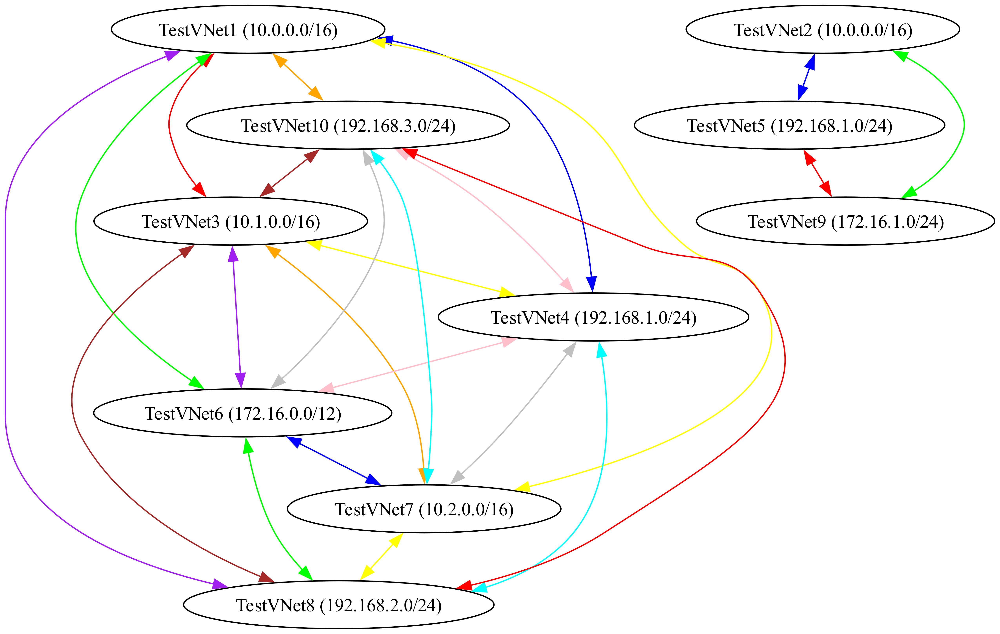

```sh
python -m venv venv
source venv/bin/activate 
pip install -r requirements.txt
export AZURE_LOG_LEVEL=WARNING
```

### Graphviz Installation:
- **Ubuntu:** `sudo apt-get install graphviz`
- **macOS:** `brew install graphviz`
- **Windows:** Download and install from [Graphviz Download Page](https://graphviz.org/download/).

### Outputs
1. **CSV Files:**
    - `all_vnets.csv`: Contains VNet details.
    - `vnet_peerings.csv`: Contains VNet peering details.
    - Sample `all_vnets.csv`:
      ```csv
      VNetName,ResourceGroup,Location,AddressSpace
      VNet1,RG1,East US,10.0.0.0/16
      VNet2,RG2,West US,10.1.0.0/16
      ```
    - Sample `vnet_peerings.csv`:
      ```csv
      SourceVNet,DestinationVNet,PeeringState
      VNet1,VNet2,Connected
      VNet2,VNet1,Connected
      ```
2. **Diagram:**
    - `vnet_peering_diagram.png`: Visual representation of VNets and their peerings.
    - Sample image:
      

### Run
```sh
python list_vnets.py
```
or 
```sh
python list_vnets.py --skip-fetch
```